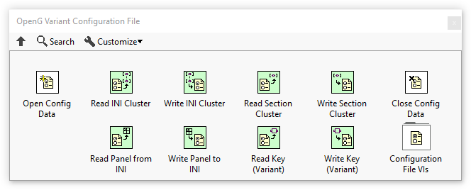

# OpenG Variant Configuration File Library

The OpenG Variant Configuration File Library package contains tools for writing and reading variant data to and from INI files.

## Installation

[Install the OpenG Variant Configuration File Library with VIPM](https://www.vipm.io/package/oglib_variantconfig/) (a.k.a oglib_variantconfig)

## How to Contribute

Take a look at the [Help Wanted](https://github.com/vipm-io/openg-variant-configuration-file-library/issues?q=is%3Aissue+is%3Aopen+label%3A%22help+wanted%22) issues list. If it's your first contribution or you're not extremely familiar with this library, you might want to look at the [Good First Issues](https://github.com/vipm-io/openg-variant-configuration-file-library/issues?q=is%3Aissue+is%3Aopen+label%3Agood+first+issue) list.  If you see an issue that looks like one you can complete, add a comment to the issue stating you'd like to work on it, and a maintainer will follow up and "assigned" to you. You then create a branch and then submit your contribution in the form of a [Pull Requests](https://github.com/vipm-io/openg-variant-configuration-file-library/pulls).

Also, please see the [OpenG Developer Guide](https://github.com/vipm-io/OpenG-Toolkit/blob/main/docs/developer-guide.md) for information on how to obtain and start contributing to the code.

## Contributors

<!-- ALL-CONTRIBUTORS-LIST:START - Do not remove or modify this section -->
<!-- prettier-ignore-start -->
<!-- markdownlint-disable -->
<table>
  <tbody>
    <tr>
      <td align="center" valign="top" width="14.28%"><a href="https://github.com/francois-normandin"> <b>Francois Normandin</b></a> <a href="#bug-francois-normandin" title="Bug reports">🐛</a></td>
    </tr>
  </tbody>
</table>

<!-- markdownlint-restore -->
<!-- prettier-ignore-end -->

<!-- ALL-CONTRIBUTORS-LIST:END -->